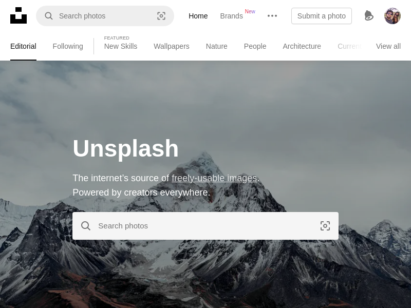

# Capturando tela Inicial, ao fazer login no UNSPLASH com puppeteer

# Como testar:

1 - Copie o `.env.local` para `.env` e adicione suas credencias do UNSPLASH
2 - Instale as dependencias com `yarn install`
3 - Execute o projeto `yarn dev`
4 - Fique a vontade para fazer modificações, são infinitas.
